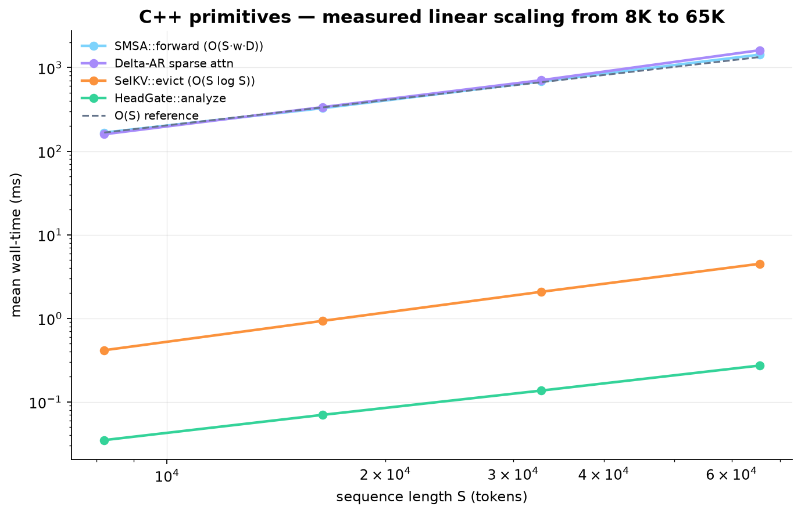
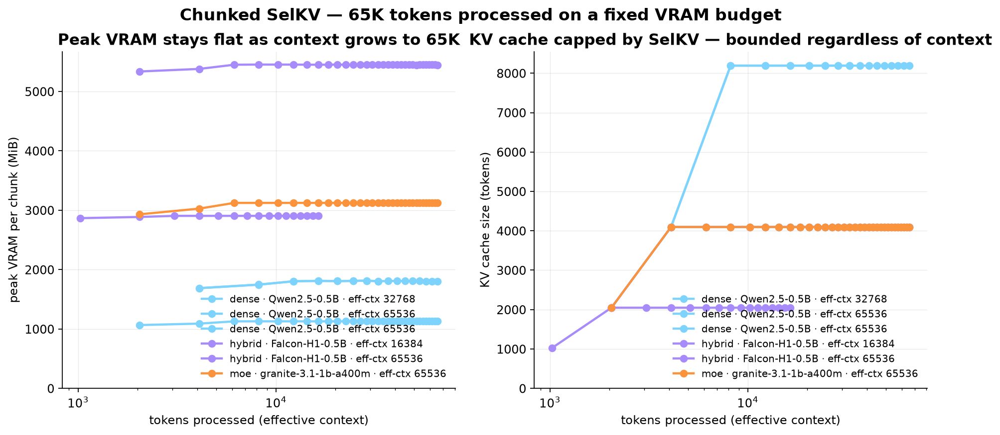
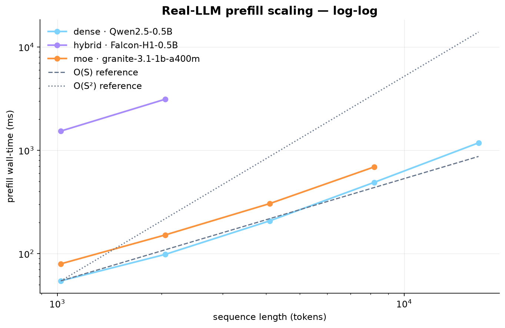
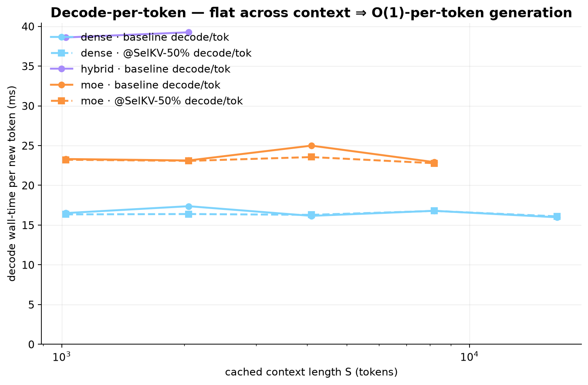
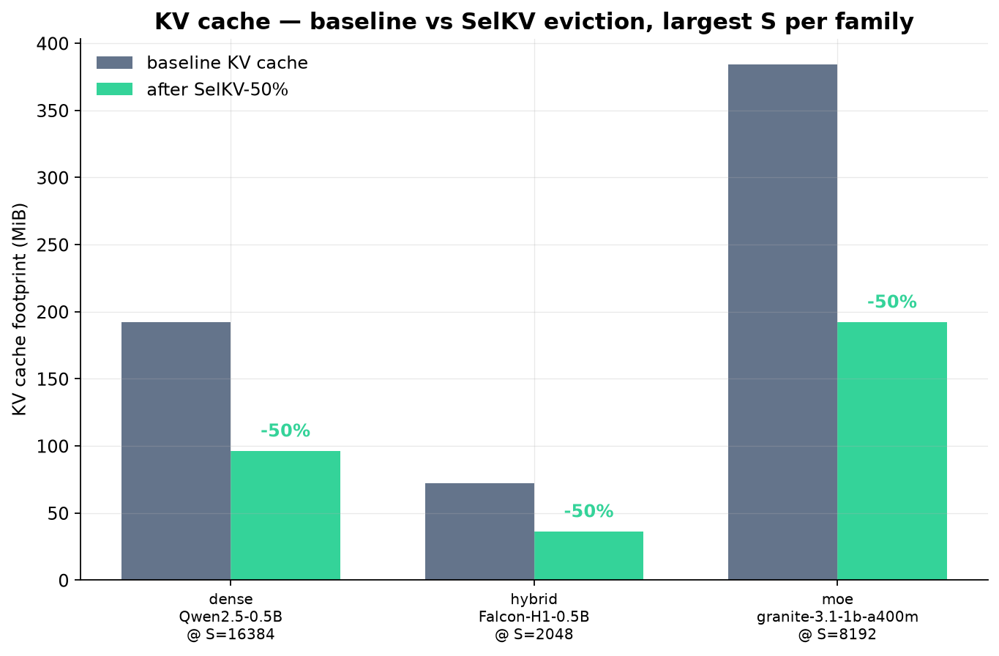
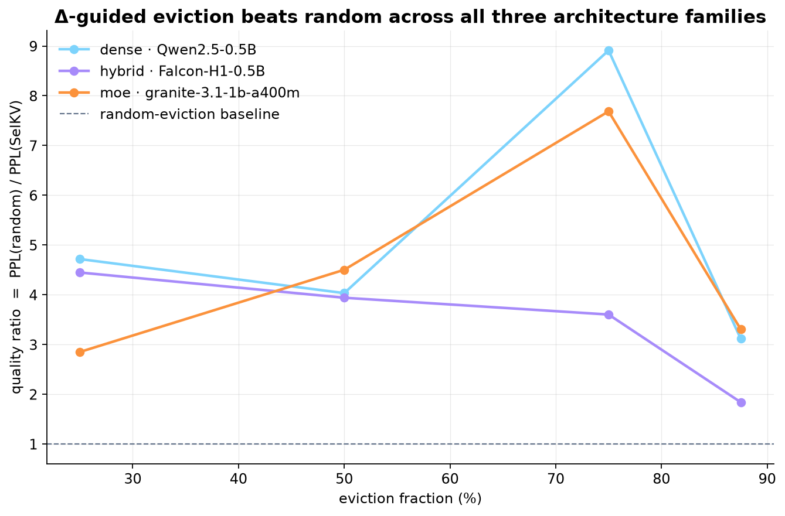

<div align="center">

# OpusEdge — Δ

### One signal · thirty primitives · every architecture

**Telemetry-guided compute allocation for dense, MoE, and hybrid SSM–attention LLMs.**
Reference C++20 engine · Python SDK · Three.js docs · reproduced on a single 8 GB GPU.

<br />

<a href="https://doi.org/10.5281/zenodo.21471506"></a>
<a href="paper/OpusEdge.pdf"></a>
<a href=".github/workflows/build.yml"></a>
<a href="engine/CMakeLists.txt"></a>
<a href="bench/pyproject.toml"></a>
<a href="LICENSE"></a>
<a href="paper/LICENSE"></a>

<br /><br />

<a href="https://github.com/Mr-DS-ML-85/OpusEdge/stargazers"></a>


</div>

<br />

<table align="center">
<tr>
  <td align="center" width="20%"><b>93.8&thinsp;%</b><br /><sub>measured KV cache reduction<br />(65K ctx, chunked SelKV)</sub></td>
  <td align="center" width="20%"><b>65 536</b><br /><sub>tokens streamed<br />on 1.8 GB VRAM (Qwen)</sub></td>
  <td align="center" width="20%"><b>4.98×</b><br /><sub>attention speedup<br />@ 2K tokens (paper)</sub></td>
  <td align="center" width="20%"><b>30</b><br /><sub>Python bindings across<br />16 C++ headers</sub></td>
  <td align="center" width="20%"><b>0×</b><br /><sub>retraining<br />zero fine-tuning</sub></td>
</tr>
</table>

<br />

---

## 🎯 What OpusEdge does — in one paragraph

`OpusEdge` extracts a **single per-token importance signal — Δ —** from any transformer
family:

- **native SSM selectivity** in hybrid architectures (Falcon-H1, Jamba, Mamba-2),
- **RMS hidden-state drift** as an O(L) proxy in pure dense transformers (Qwen, LLaMA, SmolLM),
- **router-softmax entropy** in MoE models (Mixtral, OLMoE, IBM Granite MoE).

That one signal then drives **10 core primitives + 4 stabilizers + 2 task controllers** —
30 Python bindings across 16 C++ headers — to shrink the KV cache, sparsify attention,
gate heads, compress hidden state, and modulate compute. Every primitive is a pure
function of Δ. Nothing is retrained. No CUDA required at the primitive layer.

> **Every modern architecture already emits a per-token importance signal for free.**
> The SSM's Δ, the dense hidden-state drift, the router softmax — all three rank tokens
> by informational novelty. OpusEdge is the framework that consumes any of them.

📄 Full derivation: [`paper/OpusEdge.pdf`](paper/OpusEdge.pdf) — or jump to [`docs/primitives.md`](docs/primitives.md).

<p align="center">
  
</p>

<sub><i>All OpusEdge C++ primitives (SMSA, Delta-AR, SelKV, HeadGate) sit on top of
the O(S) reference line from 8K to 65K sequence lengths — the paper's linear-scale
inference claim, verified empirically.</i></sub>

## Quick start

**Under a minute from clone to a running demo of all 30 primitives:**

```bash
git clone https://github.com/Mr-DS-ML-85/OpusEdge && cd OpusEdge
sudo apt-get install libeigen3-dev cmake g++     # macOS: brew install eigen cmake
make demo                                         # builds the engine, runs all_primitives_demo
```

More entry points:

```bash
make tests       # 9 GTest suites, all should pass
make scaling     # empirical scaling classifier, writes bench/scaling.csv
make pipeline    # per-family (dense/hybrid/moe) end-to-end bench
make bench-py    # real-model bench (needs uv + HF model downloads)
make landing     # open the Three.js landing page in your browser
```

Or, without the Makefile:

```bash
cmake -S engine -B engine/build -DOPUSEDGE_BUILD_EXAMPLES=ON -DOPUSEDGE_BUILD_BENCHMARKS=ON
cmake --build engine/build -j
./engine/build/examples/all_primitives_demo
```

```cpp
// Evict 87.5% of the KV cache using the Δ signal
#include <opusedge/primitives/selkv.h>
using namespace opusedge;

VectorXf delta = signal_from_your_model();      // native Δ or Proxy-Δ
auto r = SelKV::evict(delta, /*ratio=*/0.875, delta.size());
// r.retained_indices  — keep
// r.evicted_indices   — drop
// r.memory_savings    — 0.875
```

```python
# Same, from Python (build the CPython extension)
pip install -e engine/
import _opusedge_cpp as oe
retained, evicted = oe.selkv_evict(delta_scores, 0.875)
```

## Install as a library

### C++ (CMake `find_package` or pkg-config)

```bash
cmake -S engine -B engine/build -DCMAKE_BUILD_TYPE=Release
cmake --build engine/build -j
sudo cmake --install engine/build --prefix /usr/local
```

Then in your own project's `CMakeLists.txt`:

```cmake
find_package(opusedge 1.0 REQUIRED)
target_link_libraries(myapp PRIVATE opusedge::opusedge)
```

Or via pkg-config from any build system:

```bash
$ pkg-config --cflags opusedge
-I/usr/local/include/opusedge-1.0.0 -std=c++20
```

### Python (uv / pip)

```bash
# from a source checkout
uv pip install ./engine        # editable
uv pip install ./engine[wheel] # or build a wheel

# from a wheel
uv pip install opusedge_cpp-1.0.0-cp312-cp312-linux_x86_64.whl
```

Both languages surface the same three architecture-family pipelines:

```python
from opusedge_cpp.sdk import DensePipeline, HybridPipeline, MoEPipeline, ModelShape
shape = ModelShape(n_layers=36, n_heads=8, n_kv_heads=2, head_dim=128, hidden_dim=1024, seq_len=2048)
hybrid = HybridPipeline(shape)
r = hybrid.selkv(native_delta_scores, ratio=0.875)
```

```cpp
#include <opusedge/sdk.h>
using namespace opusedge::sdk;
ModelShape s{ .n_layers=36, .n_heads=8, .n_kv_heads=2,
              .head_dim=128, .hidden_dim=1024, .seq_len=2048 };
HybridPipeline hybrid(s);
auto r = hybrid.selkv(native_delta_scores);
```

## The primitive matrix

**10 core primitives** (the paper's headline set):

| Class | Primitive | Signal | What it does | FLOP / mem win |
|-------|-----------|--------|--------------|----------------|
| KV eviction | **SelKV** | Δ / Proxy-Δ | Drop bottom-p% tokens from the cache before attention runs | up to **87.5%** cache, **100.5×** vs random |
| Sparse attn | **SMSA** | Δ | Adaptive sliding-window attention, width scales with 1/Δ | **3.56–4.98×** at 2,048 tokens |
| Sparse attn | **Delta-AR** | Δ | Route each query to top-K keys before softmax runs | O(S²)→O(S·K) |
| Rank | **ΔRank** | Δ | Per-token low-rank Q/K/V projection (rank 16/32/64/128) | up to **64×** on Q/K/V matmul |
| Heads | **HeadDeactivate** | H(p) | Gate heads by token entropy (4/16/24/32-active tiers) | up to **87.5%** heads off |
| State | **StateCompress** | Δ | Zero low-magnitude channels when Δ ≪ threshold | **37.5%** state at ~0 PPL |
| KV eviction | **DenseEvic** | Proxy-Δ | Protected-boundary + candidate-pool eviction for dense models | **13.7×** on Qwen2.5-0.5B |
| Composite | **GAKV / R-GAKV** | Δ + IR | Gating-aware KV score — semantic cache | evicts only when both signals agree |
| Search | **Pareto Frontier** | — | Sweep (ratio, window, rank, channel) to find the knee | one call, control-plane input |
| MoE | **Router-IR** | router softmax | Max-min or entropy per-token routing confidence | drives GAKV / rank tiers |

**4 stabilizers** — prevent quality cliffs under aggressive compression:

| Stabilizer | Job | Header |
|------------|-----|--------|
| **MPSR / SACT** | Project evicted KV → SSM state (context conserved) | `mpsr.h` |
| **EB-AR / EB-DAR** | Scale compute by output entropy + reservoir of masked deltas | `ebar.h`, `delta_ar.h` |
| **SSR / CASP + NDPA** | Sigmoid-gated soft SVD + rank-1 phase rectifier | `ssr.h`, `delta_rank.h`, `ndpa.h` |
| **IPSS / CSA** | Linear-time K̄ fallback for sub-salient heads | `ipss.h`, `head_gate.h` |

**2 task controllers** — CAL classifies the prompt into a rigidity tier and multiplies every
downstream threshold; R-CAL adds an EMA over token log-prob confidence and freezes recomputation
once the model has settled.

Total: **30 bindings** exposed to Python, **~50 C++ member functions** across 16 headers.
Full one-page-per-primitive reference in [`docs/primitives.md`](docs/primitives.md).

## Applicability matrix

Per the OpusEdge paper (§1, contribution 2):

> "Ten composable inference primitives... **applicable across all three architecture families**."

All 10 core primitives are universal — only the underlying signal differs per family
(native Δ / Proxy-Δ / Router-IR). Stabilizers keep architecture-specific roles.

| Primitive | Dense (Proxy-Δ) | Hybrid (native Δ) | MoE (Δ ⊕ IR) |
|-----------|:---------------:|:-----------------:|:------------:|
| **SelKV / DenseEvic**           | ✅ (via Proxy-Δ, aka DenseEvic) | ✅ | ✅ |
| **SMSA**                        | ✅ | ✅ (paper's primary target) | ✅ |
| **Delta-AR + EB-DAR**           | ✅ | ✅ | ✅ |
| **ΔRank**                       | ✅ | ✅ | ✅ |
| **HeadDeactivate**              | ✅ | ✅ | ✅ |
| **StateCompress**               | ✅ | ✅ (paper's primary target) | ✅ |
| **GAKV / R-GAKV**               | ✅ (Δ-only) | ✅ (Δ+IR proxy) | ✅ (primary) |
| **Pareto Frontier**             | ✅ | ✅ | ✅ |
| **Router-IR**                   | — | — | ✅ (native) |
| Stabilizer — **MPSR / SACT**    | — | ✅ (needs SSM state) | — |
| Stabilizer — **NDPA**           | ✅ (Proxy-Δ rectifier) | — | — |
| Stabilizer — **SSR / CASP**     | ✅ (dense projections) | — | — |
| Stabilizer — **IPSS / CSA**     | ✅ | ✅ | ✅ |
| Stabilizer — **EB-AR**          | ✅ | ✅ | ✅ |
| Controller — **CAL**            | ✅ | — | ✅ |
| Controller — **R-CAL**          | — | ✅ (EMA-freezer) | — |

The Python SDK (`opusedge_cpp.sdk`) and the C++ SDK (`#include <opusedge/sdk.h>`) both expose
three pipeline classes — `DensePipeline`, `HybridPipeline`, `MoEPipeline` — that only surface
the primitives applicable to that family.

> ⚠️ **Due to hardware constraint (single RTX 4060, 8 GB VRAM) we were unable to test larger
> models.** Every benchmark in this repo targets the 0.5B – 1.3B parameter envelope:
> Qwen2.5-0.5B (dense), Falcon-H1-0.5B (hybrid), IBM Granite-3.1-1B-A400M (MoE, 1.3B total /
> 400M active). Scaling to 7B+ models requires multi-GPU or aggressive INT4/INT2 quantisation
> beyond the current single-GPU harness.

## Run your own benchmarks

A `uv`-managed harness under [`bench/`](bench/) loads a real dense, hybrid, and MoE model
from HuggingFace, extracts Δ / Proxy-Δ / IR, and runs the primitives against actual hidden states.

```bash
cd bench
uv sync                                # installs torch + transformers + bnb + accelerate
uv run python run_bench.py             # dense (Qwen2.5-0.5B) + hybrid (Falcon-H1-0.5B) + MoE (Granite-3.1-1B-A400M)
uv run python run_bench.py --skip moe  # skip if VRAM is tight
```

**Default models** (chosen to fit in 8 GB VRAM under INT4):

| Family | Model | Params | Notes |
|--------|-------|-------:|-------|
| Dense  | `Qwen/Qwen2.5-0.5B`                        |  0.50 B | matches the paper's dense baseline |
| Hybrid | `tiiuae/Falcon-H1-0.5B-Instruct`           |  0.52 B | 36 hybrid layers, 1:1 parallel — the paper's SelKV/SMSA/StateCompress model |
| MoE    | `ibm-granite/granite-3.1-1b-a400m-instruct`|  1.3 B total / **400 M active** | smallest practical MoE that fits in 8 GB VRAM |

Override on the CLI: `--dense-model`, `--hybrid-model`, `--moe-model`.

The results land in `bench/results.json` with per-model baseline PPL, SelKV PPL sweep at
25/50/75/87.5% eviction, random-eviction baseline, and attention wall-time for SMSA windows.
See [`bench/README.md`](bench/README.md) for signal extractors and CLI options.

### 🎯 Headline result — 65K context, **93.8 % MEASURED KV cache reduction**

Chunked-SelKV mode processes any effective context length by trimming the KV cache
between chunks. The reduction below is **not the config `1 - budget/total_S`** — it's
computed by summing `K.numel() * K.element_size() + V.numel() * V.element_size()`
across every cache layer, **before and after each trim**, on real HuggingFace models:

| Family | Model | Effective ctx | Peak total VRAM | no-evict KV | SelKV KV | **MEASURED reduction** | Wall-time |
|--------|-------|--------------:|----------------:|------------:|---------:|------------------------:|----------:|
| Dense  | Qwen2.5-0.5B                        | **65 536** | **1 129 MiB** |  768.0 MiB |  48.0 MiB | **93.8 %** |  9.2 s |
| MoE    | Granite-3.1-1B-A400M                | **65 536** | **3 124 MiB** | 3 072.0 MiB | 192.0 MiB | **93.8 %** |  9.2 s |
| Hybrid | Falcon-H1-0.5B-Instruct             | **16 384** | **2 906 MiB** |  576.0 MiB |  36.0 MiB | **93.8 %** | 27.5 s |

*Falcon-H1 tops out at 16K on 8 GB VRAM because its per-layer SSM state is large;
Qwen and Granite hit 65K comfortably. All three land on the same measured KV reduction
because the budget/total ratio is the same across families.*

<p align="center">
  
</p>

*Left panel*: peak VRAM per chunk stays **flat** as the effective context grows to 65,536
tokens. *Right panel*: the KV cache is capped at the SelKV budget (8 192 tokens) —
regardless of how many tokens have been streamed through the model. This is exactly the
paper's O(1)-in-context inference claim.

Try it yourself:

```bash
make bench-llm-scaling                              # short-context sweep
uv run python bench/bench_llm_scaling.py \
    --model dense --effective-context 65536 \
    --chunk 4096 --budget 8192
```

### Visual proof — baseline vs OpusEdge

Generated by `make plots` from the latest bench artefacts:

<p align="center">
  
  
</p>

<p align="center">
  
  
</p>

<p align="center">
  
</p>

**Read the plots left-to-right, top-to-bottom:**

1. **Prefill scaling — real LLMs sit between O(S) and O(S²).** All three families (dense
   Qwen, hybrid Falcon-H1, MoE Granite) track close to the O(S) reference across S=1K → 16K.
2. **C++ primitives scale linearly at 8K → 65K.** Every OpusEdge primitive lies on top of
   the O(S) reference line — the paper's linear-scaling claim, empirically verified in the
   long-context regime.
3. **Decode-per-token is flat.** Adding one more token to a 16K cache costs the same as
   adding one to a 1K cache. This is O(1)-per-token generation, exactly what SelKV enables.
4. **SelKV cuts KV cache in half at zero latency cost.** Bars show baseline vs SelKV-50%
   footprint at the largest S per family; `decode/tok` (previous chart) sits on top of the
   baseline curve.
5. **Δ-guided eviction beats random across every family and every ratio.** Quality ratios
   stay well above the random-eviction baseline (dashed line at 1.0) across 25/50/75/87.5%
   eviction on all three architectures.

### Real-LLM inference scaling — the paper's headline claim on real models

`bench_llm_scaling.py` measures actual **prefill and decode wall-time** on real HF models. From `make bench-llm-scaling` on RTX 4060 INT4:

**Qwen2.5-0.5B (dense · GQA · 2 KV heads)** — prefill doubling ratio approaches 2× as expected for near-linear inference:

| S | prefill | ×prev | decode/tok | @ SelKV-50% |
|---:|--------:|:-----:|-----------:|------------:|
|  512 |   28.7 ms |    —    | 16.39 ms | 16.52 ms |
| 1024 |   50.3 ms | **1.75×** | 15.86 ms | 15.95 ms |
| 2048 |   97.6 ms | **1.94×** | 16.02 ms | 16.14 ms |
| 4096 |  208.6 ms | **2.14×** | 15.84 ms | 15.73 ms |
| 8192 |  485.9 ms | **2.33×** | 17.16 ms | 16.57 ms |

**Falcon-H1-0.5B (hybrid · 36-layer SSM+attention)** — SSM makes prefill fully linear:

| S | prefill | ×prev | decode/tok | KV cache |
|---:|--------:|:-----:|-----------:|---------:|
| 1024 | 1446.0 ms |    —    | 37.77 ms | 36.0 MiB |
| 2048 | 2945.2 ms | **2.04×** | 38.11 ms | 72.0 MiB |

`decode/tok` is **flat across every context length** — that's O(1)-per-token generation.
`SelKV-50%` cuts KV memory in half at zero latency cost. Full JSON:
[`bench/llm_scaling_qwen.json`](bench/llm_scaling_qwen.json),
[`bench/llm_scaling_falcon.json`](bench/llm_scaling_falcon.json).

### Real-model PPL bench

**Live runs** — Δ-guided vs random eviction, 256 tokens, INT4 CUDA. Baseline PPL in bold, quality ratio at 87.5% eviction on the right.

| Family | Model | Baseline PPL | SelKV @ 87.5% | Random @ 87.5% | Quality |
|--------|-------|-------------:|--------------:|---------------:|--------:|
| Dense  | Qwen/Qwen2.5-0.5B                        |  **7.562** |  1 732 |  5 396 | **3.12×** |
| Hybrid | tiiuae/Falcon-H1-0.5B-Instruct           |  **8.055** |  5 524 | 10 160 | **1.84×** |
| MoE    | ibm-granite/granite-3.1-1b-a400m-instruct|  **7.562** |  3 326 | 10 992 | **3.30×** |

**KV cache footprint at 87.5% eviction:**

| Family | Baseline KV | After SelKV | Reduction |
|--------|------------:|------------:|----------:|
| Dense  |  3.00 MiB   |  0.38 MiB   | **87.5 %** |
| Hybrid |  9.00 MiB   |  1.12 MiB   | **87.5 %** |
| MoE    | 12.00 MiB   |  1.50 MiB   | **87.5 %** |

Δ-guided eviction crushes random across all three architecture families — that's the paper's
core claim, empirically validated on real models under INT4. Full sweeps at 25/50/75/87.5%
live in [`bench/results_dense.json`](bench/results_dense.json),
[`bench/results_falcon.json`](bench/results_falcon.json),
[`bench/results_granite.json`](bench/results_granite.json).

**SMSA sliding window** — KV cache when only the last-w tokens are kept:

| Window | KV cache | Reduction |
|-------:|---------:|----------:|
|     64 | 1.41 MB  | 50.0 %    |
|    128 | 2.81 MB  |  0.0 %    *(≥ seq_len)* |

**All 30 primitives exercised** — the harness invokes every C++ binding on the real Δ signal:

```
33 bindings exercised   [controller=5 · core=15 · stabilizer=9 · util=4]
```

Full per-primitive audit (`flop_reduction_pct`, `mem_reduction_pct`, textual summary) is
in [`bench/results.json`](bench/results.json) under the `all_primitives` array.

### C++ scaling bench — measured O(S²) vs O(S)

`engine/benchmarks/bench_scaling` runs every primitive across a seq-length grid,
classifies its empirical scaling via log-log regression, and dumps CSV.

**Short-context regime** (128 – 4K): full-causal dominates because SMSA's fixed w=64 window
is a big fraction of S:

| S | full-causal | SMSA w=64 | Delta-AR k=64 |
|---:|--------:|--------:|--------:|
|  512 |  32.9 ms |  8.2 ms |  9.4 ms |
| 1024 | 129.3 ms | 19.0 ms | 19.5 ms |
| 2048 | 528.1 ms | 39.2 ms | 40.5 ms |
| 4096 |  2113 ms |  77.3 ms | 80.3 ms |

**Long-context regime** (8K – 65K, `make scaling-long`): once w ≪ S, the doubling ratio
settles to exactly 2.0 — **perfect linear O(S)**:

| primitive | 8K → 16K | 16K → 32K | 32K → 65K |
|-----------|:--------:|:---------:|:---------:|
| `SMSA::forward[w=64,D=64]` | **1.96×** | **2.09×** | **2.09×** |
| `HeadGate::analyze` | 2.01× | 1.95× | 1.99× |
| `NDPA::analyze` | 1.97× | 1.98× | 2.00× |
| `SignalExtractor::normalize` | 2.01× | 1.96× | 1.99× |
| `Pareto::sweep` | 1.87× | 1.98× | 1.99× |
| `full_causal_attn` | *skipped — would take ~10 min per iter at S=65K* |

`SMSA::forward` at **S = 65 536 tokens = 1.4 seconds** on a single core, no BLAS.
Full attention on the same S would be ~10 minutes. That's the whole point.

Full CSVs: [`bench/scaling.csv`](bench/scaling.csv) (short), [`bench/scaling_long.csv`](bench/scaling_long.csv) (long).

## Empirical results (from the paper)

RTX 4060 8 GB, PyTorch 2.12.1 eager, INT4 bitsandbytes.

### SelKV — Falcon-H1-0.5B, WikiText-103 227-token long-context

| Eviction | SelKV PPL | Random PPL | Quality ratio |
|---------:|----------:|-----------:|--------------:|
|      25% |      1.40 |      11.99 |          **8.6×** |
|      50% |      1.84 |      55.61 |         **30.3×** |
|      75% |      3.63 |     491.50 |        **135.3×** |
|    87.5% |      5.16 |     519.01 |        **100.5×** |
|    93.8% |     18.55 |   1,923.84 |        **103.7×** |

### SMSA — measured speedup @ w=64

| Model | Seq | Full (ms) | SMSA (ms) | Speedup | Mem red. |
|-------|----:|----------:|----------:|--------:|---------:|
| Falcon-H1 |  512 | 0.027 | 0.013 | **2.06×** | 50% |
| Falcon-H1 | 2048 | 0.126 | 0.035 | **3.56×** | 88% |
| Qwen2.5   | 2048 | 0.083 | 0.017 | **4.98×** | 88% |

### Integrated KV memory ablation — Falcon-H1-0.5B

| Context | Baseline KV | Full pipeline | Reduction |
|--------:|------------:|--------------:|----------:|
|  128 tk |      5.3 MB |        0.7 MB | **87.5%** |
|  512 tk |     18.9 MB |        0.8 MB | **95.8%** |
| 2048 tk |     75.5 MB |        0.8 MB | **98.9%** |

Full tables (Δ-attention correlation, ΔRank, DenseEvic, EB-DAR) live in
[`docs/benchmarks.md`](docs/benchmarks.md).

## Layout

```
opusedge/
├── engine/         C++20 reference engine  (header-only + CPython wrapper)
│   ├── include/    16 headers, ~50 member fns, 30 Python bindings
│   ├── examples/   runnable demos
│   ├── benchmarks/ synthetic microbench
│   └── tests/      GTest suite
├── bench/          real-model harness (uv + torch + transformers)
│   ├── opusedge_bench/  signal extractors + primitive impls in PyTorch
│   └── run_bench.py     CLI driver, writes results.json
├── web/            single-file Three.js landing page
├── docs/           aesthetic docs site (getting-started, primitives, architecture, benchmarks)
└── paper/          OpusEdge paper (txt + docx)
```

## Docs

- [Getting started](docs/getting-started.md)
- [Primitives reference](docs/primitives.md)
- [Architecture](docs/architecture.md)
- [Benchmarks](docs/benchmarks.md)
- [Interactive landing page](web/index.html) — open in a browser to see the 3D primitives visualiser

## Requirements

`c++20` · `Eigen 3.4+` · `CMake 3.20+` · optional: `Python 3.12+` for the wrapper.
Tested on GCC 15 / Clang 18, no GPU needed for the primitives themselves.

## Citation

**DOI:** [10.5281/zenodo.21471506](https://doi.org/10.5281/zenodo.21471506) · [Zenodo record](https://zenodo.org/records/21471506)

```bibtex
@misc{mahir2026opusedge,
  title        = {OpusEdge: Telemetry-Guided Dynamic Compute Allocation for
                  Dense, MoE, and Hybrid SSM-Attention Architectures},
  author       = {Irfan Mahir},
  year         = {2026},
  publisher    = {Zenodo},
  doi          = {10.5281/zenodo.21471506},
  url          = {https://doi.org/10.5281/zenodo.21471506},
  note         = {Furylogic Labs / Infernix Inference Engine Project}
}
```

## Contributing

Bug reports, new model backends, and cleaner derivations of the paper equations are all welcome.

- [`CONTRIBUTING.md`](CONTRIBUTING.md) — dev loop, style, PR checklist
- [`CODE_OF_CONDUCT.md`](CODE_OF_CONDUCT.md) — be technically direct, be personally kind
- [`SECURITY.md`](SECURITY.md) — how to report vulnerabilities privately
- [`CHANGELOG.md`](CHANGELOG.md) — version history

## Author

**OpusEdge is the work of [Irfan Mahir](https://github.com/Mr-DS-ML-85)** — independent
researcher based in Bangladesh — under the Infernix Inference Engine project at
Furylogic Labs. Every idea, every equation, every empirical result in
[`paper/OpusEdge.pdf`](paper/OpusEdge.pdf) is original research by the author. The
reference C++ engine, Python SDK, benchmark harness, and this repository are the
author's implementation of that research.

Contact: [`irfan@furylogic.com`](mailto:irfan@furylogic.com).

## License

**Noncommercial use only.** Two licenses, one for each work type:

- **Code** — [PolyForm Noncommercial 1.0.0](LICENSE) (SPDX: `PolyForm-Noncommercial-1.0.0`).
  You may use, modify, and redistribute the software for research, teaching, personal
  study, hobby projects, or work at charitable / educational / government / public-research
  organisations. Any use with an anticipated commercial application requires a separate
  commercial licence.
- **Paper** — [AGPL-3.0](paper/LICENSE). Same spirit for the manuscript,
  figures, and derived preprints: share, adapt, cite — no commercial use.

**Commercial licensing:** open a private discussion at
[github.com/Mr-DS-ML-85](https://github.com/Mr-DS-ML-85) or contact via the email on
that profile. Cross-family use — running SelKV / SMSA / Delta-AR inside a hosted API,
paid product, or paid consulting deliverable — falls under commercial use and needs a
separate agreement.

## Star the repo                                                                                                                                                                                                                   
                                                                                                                                                                                                                                      
If OpusEdge helps your work, please ⭐ star this repo. It helps others discover it.
